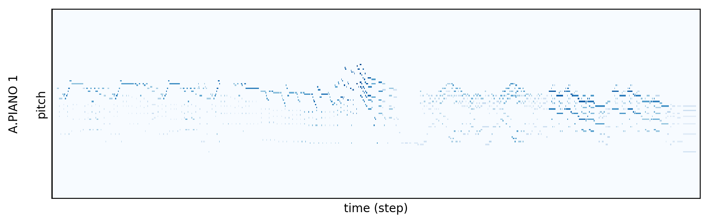
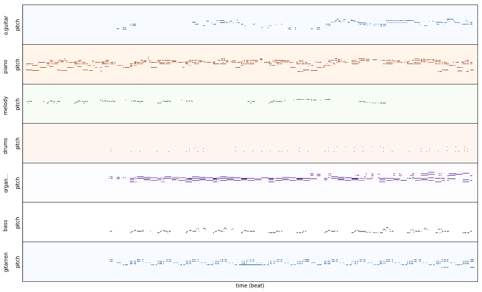
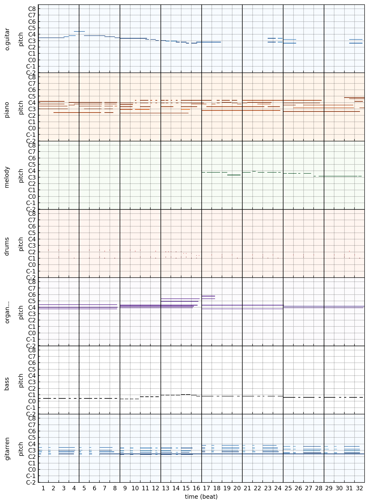

=============
Visualization
=============

Pypianoroll provides tools for visualizing piano rolls. Here are some examples.

Functions
=========

.. autofunction :: pypianoroll.plot
    :noindex:

.. autofunction :: pypianoroll.plot_multitrack
    :noindex:

.. autofunction :: pypianoroll.plot_track
    :noindex:

.. autofunction :: pypianoroll.plot_pianoroll
    :noindex:
